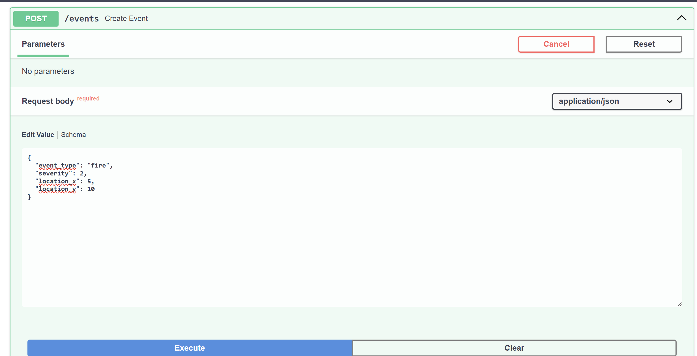
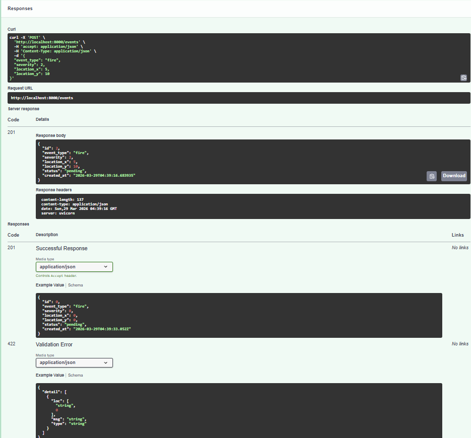
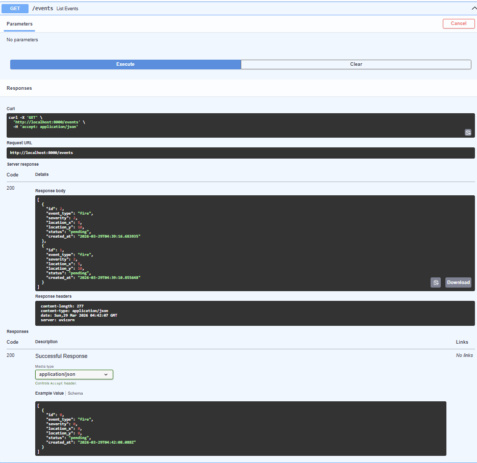
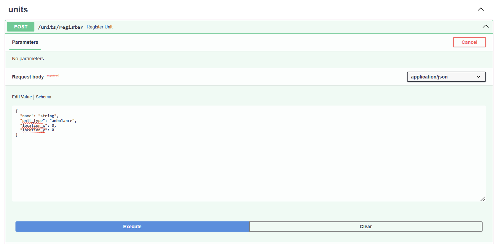
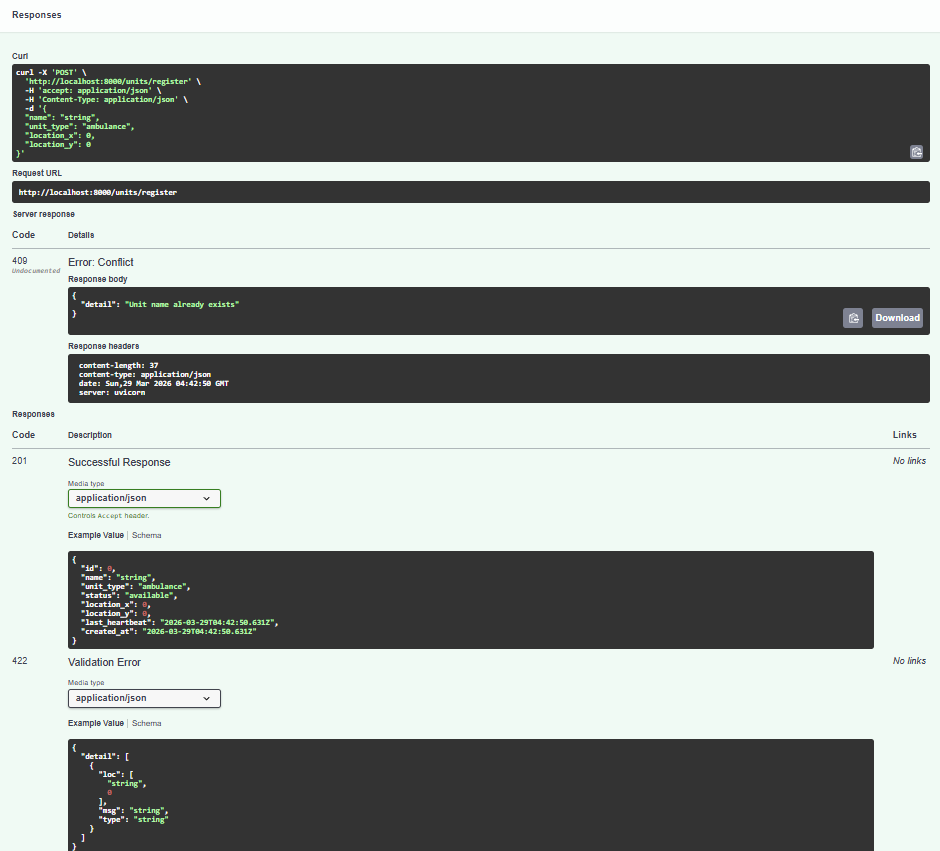
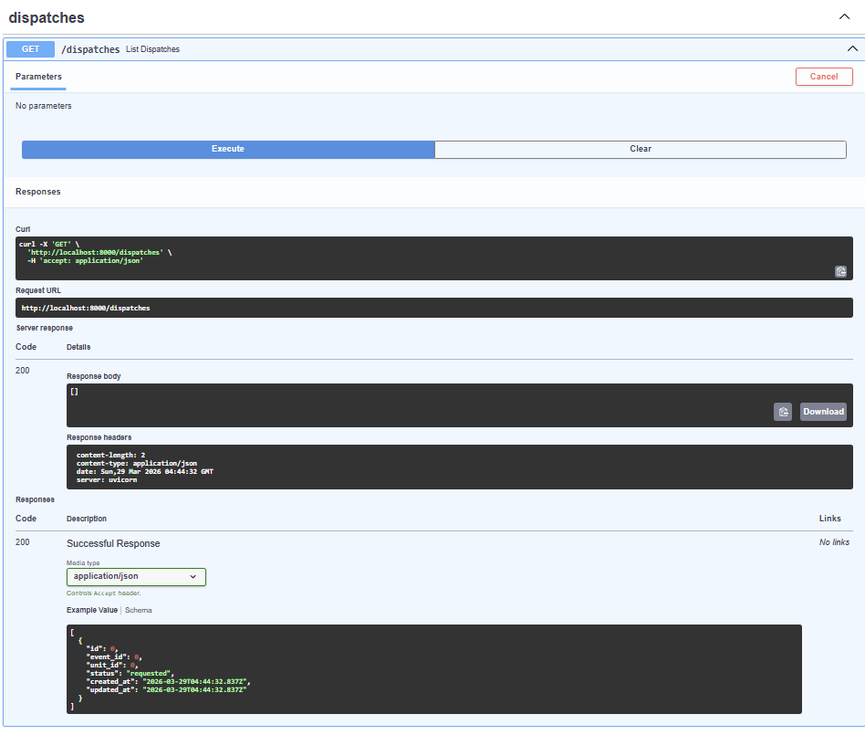

# Distributed Disaster Control System

## Overview
This project is a distributed cloud-based disaster response system developed for **COE892: Distributed Cloud Computing Systems**. It simulates real-time coordination between emergency events and response units such as ambulances, fire trucks, and police.

The system is built using a microservices architecture and includes:
- API Gateway (FastAPI)
- Event management service
- Unit registration and tracking
- Dispatch coordination
- PostgreSQL database
- RabbitMQ messaging system
- Docker containerization

---

## Features

- Create and manage disaster events
- Register and track emergency units
- Dispatch units to events
- Monitor system health
- Fully containerized using Docker

---

## Technologies Used

- Python (FastAPI)
- Docker & Docker Compose
- PostgreSQL
- RabbitMQ
- REST APIs

---

## System Demonstration

### 1. Create an Event

**Input:**



**Result:**



---

### 2. List Events



---

### 3. Register a Unit

**Input:**



**Result:**



---

### 4. View Dispatches



---

## Getting Started

### Prerequisites
- Docker Desktop installed
- Git installed

### Run the Project

```bash
git clone https://github.com/sayeedx/distributed-disaster-control-system
cd distributed-disaster-control-system
docker compose up --build

to solve issues run these:
docker compose down -v
docker system prune -a --volumes -f
docker compose build --no-cache
docker compose up